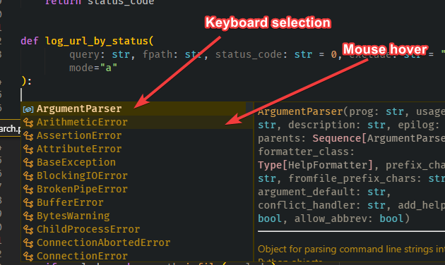
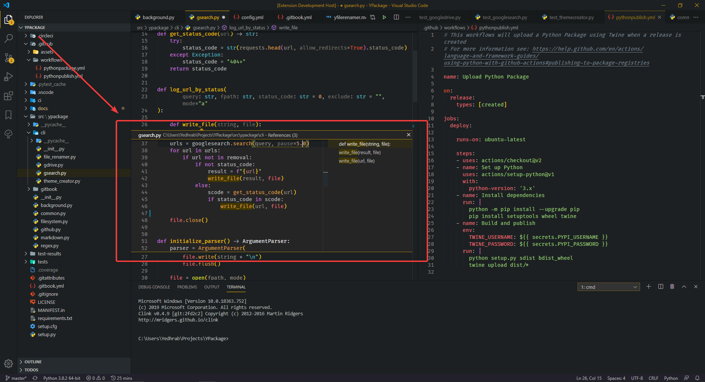
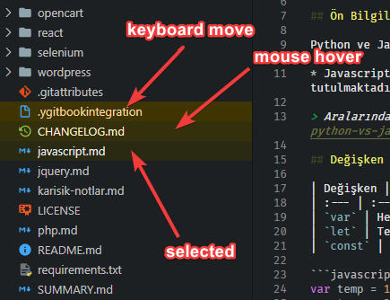

# ✨ Changelog

## 🚀 4.1.6

- ✨ More visual keyboard improvement
- 👨‍🎨 Peek view resdesigned

## 🏷️ 4.1.5

✨ Some color improvements

- 🎨 List hover and select colors are renewed
- 📝 Documentation and contribution renewed
- 🔨 Configurations files added

## 🏷️ 4.1.4 \(14.02.2019\)

👨‍🎨 New code colorizer added

- 🎨 Item access, fstring, item access parameters colors added
- 📝 Documentation renewed
- 💦 Unnecessaries removed

> 👨‍🔧 Minor fixing in documentation

## 🏷️ 4.1.3 \(13.02.2019\)

👨‍🔧 Color improvements and error fixing

- 📈 More effective [👨‍🔬 YThemeCreator](https://github.com/yedhrab/YThemeCreator)
- 📋 Color list improved
- 👪 Contributing via [👨‍🔬 YThemeCreator](https://github.com/yedhrab/YThemeCreator) is easier than before

##  🏷️ 4.1.2 \(12.02.2019\)

👨‍🔧 Color improvements and error fixing

- 👨‍🎨 Button colors renewed
- 👨‍🔧 DarkCode - DarkCode Contrast color conversion errors fixed
- [👨‍🔬 YThemeCreator](https://github.com/yedhrab/YThemeCreator) guide added

> 👪 Contributing is easier than before

##  🏷️ 4.1.1 \(03.02.2019\)

- 👨‍🎨 Editor slider color is more visible now
- 🎨 Minor color improvements

> ☀️ Light Themes unaffected by changes

##  🏷️ 4.1.0 \(28.01.2019\)

🎨 Color improvements

- 🐥 Menu and hover color is more smooth now
- 🌃 Editor widget has shadow color
- 👨‍🎨 Terminal and editor selection bacground renewed
- 👨‍🎨 List hover, selection background and foreground recolorized
- 💦 Line highlight removed (same as background color)

> ☀️ Light Themes unaffected by changes

##  🏷️ 4.0.5

🤝 AHK assignment operator support

- ✨ Assigment operator hightlight for YAutoHotkeys
- 👁️ Visual border color to activityBar
- 👨‍💻 Core theme is moved new folder

> ☀️ Light Themes unaffected by changes

## 🏷️ 2.0.3 \(2019-12-4\)

- 👨‍🔧 Neme is changed to YDarkcode Theme
- 🤝 Added AutoHotkey support

## 🏷️ 2.0.1 \(2019-12-1\)

- 📑 Added descriptions

## 🏷️ 2.0.0 \(2019-12-1\)

- 🚙 Serving to new changes and app
- 🚀 More colors and supports.
  * 🤝 Now supports all languages
  * 🎨 More color space
  * 👀 More readable and focusable
  * 🎉 New name and description

## 🏷️ 1.4.1 \(2019-11-25\)

- 🤝🏿 Added supported extension.
- ✨ Color optimization.
  - Terminal cursor became yellow (only contrast+)
  - Terminal bg became little brighter (only contrasts)
- 🌑 More darker list item colors.
- 🚀 New version (1.4.0)
  - ✨ Visual improvements
  - 👨‍🔧 Color palette fixes
- 🚀 New release (1.3.3)
  - 👁‍🗨 More visual link color for all themes
- 📑 Explaning added.
- ✅ Tested version released.
- 🐞 Manifest error fixed.
- 📑 Changelog updated.
- 🚀 Plus themes are added.
- ✨ Visibility improvement.
  - Visible comment, markdown link and header

## 🏷️ 1.2.0 (2019-11-12)

- 🚀 New version (1.2.0)
- 🧹 Unnecessary file is deleted.
- 🚀 Contrast theme is added.
- 🚀 Contrast teması eklendi.
- Update README.md.
- Update README.md.
- Clearify.
- Summary 🕺
- Summary 🕺
- Added TODOs.
- Version update.
- Badge ಠ_ಠ.
- Added badge 💫
- 1.1.0.
- Just beatufication ✨
- Update package infos.
- Additional infos ℹ.
- First theme 🎉
