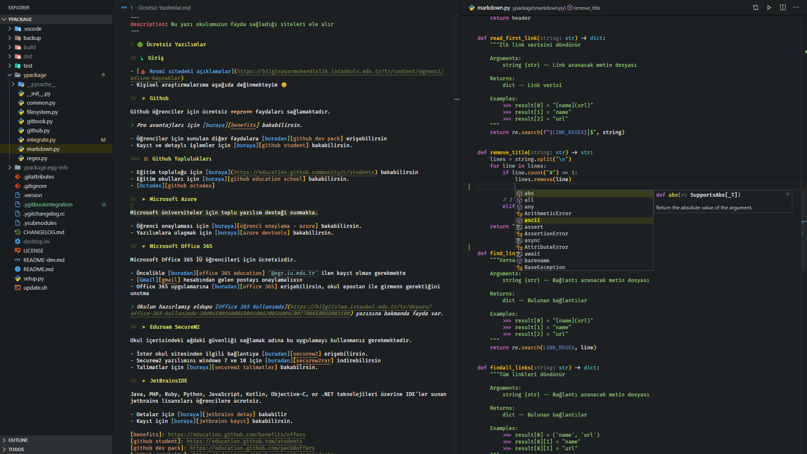

# DarkCode Theme Adopted Python and Markdown

> Inspired by [CodeSandbox Theme](https://marketplace.visualstudio.com/items?itemName=ngryman.codesandbox-theme)

## TODOs

- [ ] `string.quoted.docstring.multi.python` içerisindeki TODO, !, :, ? gibi alanlarda satırın rengi değiştirilecek
- [ ] Better comment eklentisi ilave edilecek

## Destek ve İletişim

[][mail]
[][github]
[][website]
[][linkedin]
[][bağış anlık]

[][bağış aylık]

**The [MIT License](https://choosealicense.com/licenses/mit/) &copy; Yunus Emre Ak**

<!-- İletişim -->

[mail]: mailto::yedhrab@gmail.com?subject=DarkCode%20Theme%20%7C%20Github
[github]: https://github.com/yedhrab
[website]: https://yemreak.com
[linkedin]: https://www.linkedin.com/in/yemreak/
[bağış anlık]: https://gogetfunding.com/yemreak/
[bağış aylık]: https://www.patreon.com/yemreak/

<!-- İletişim Sonu -->
