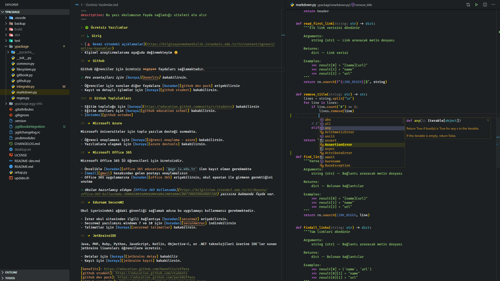
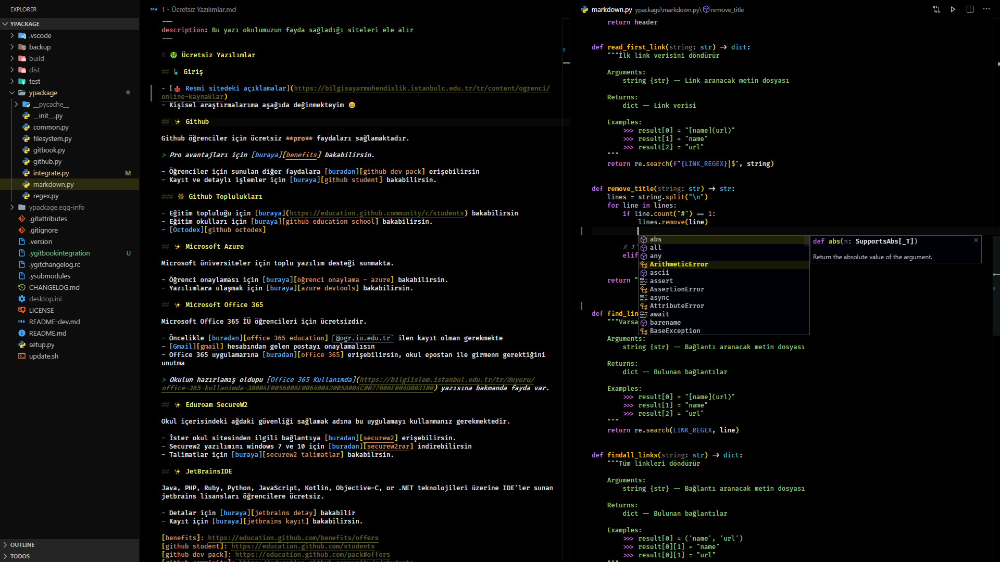
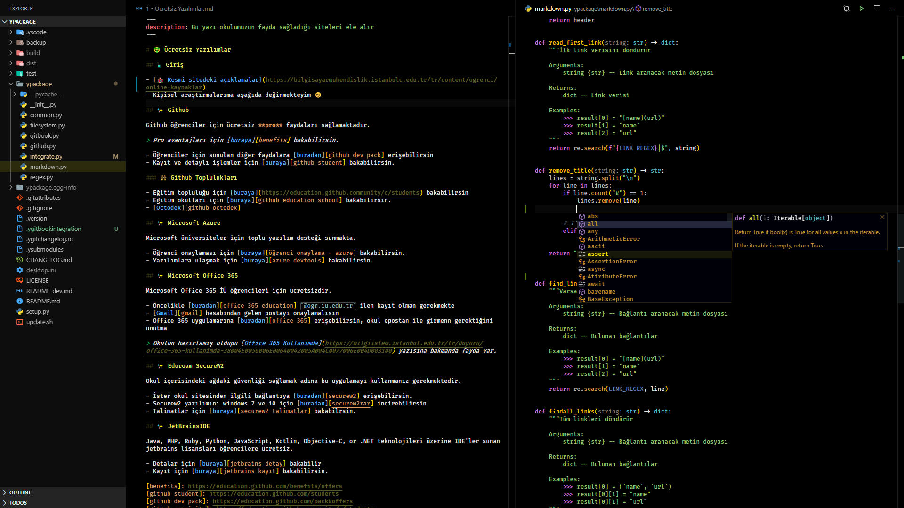
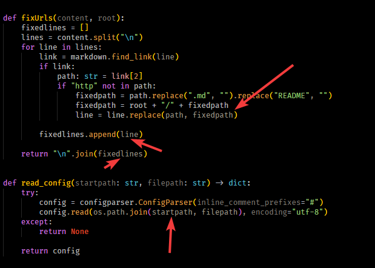
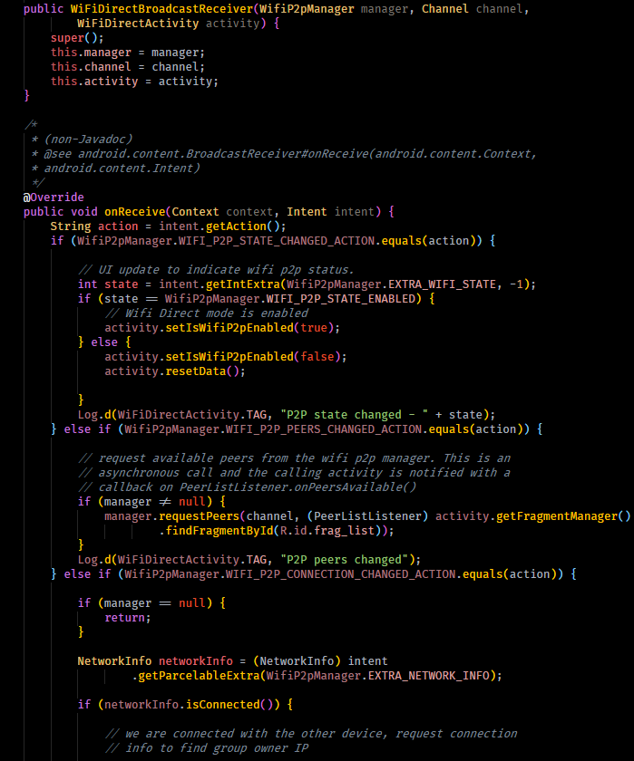

# ✨ DarkCode Theme Adopted Python and Markdown <!-- omit in toc -->

༼ つ ◕_◕ ༽つ DarkCode Theme for VsCode Adopted Python and Markdown 👨‍💻

## 📋 Contents <!-- omit in toc -->

- [🎯 Focused](#%f0%9f%8e%af-focused)
- [👁‍🗨 Preview](#%f0%9f%91%81%e2%80%8d%f0%9f%97%a8-preview)
  - [🌓 DarkCode](#%f0%9f%8c%93-darkcode)
  - [🌗 DarkCode+](#%f0%9f%8c%97-darkcode)
  - [🌑 Darkcode Contrast](#%f0%9f%8c%91-darkcode-contrast)
  - [🌒 DarkCode Contrast+](#%f0%9f%8c%92-darkcode-contrast)
- [✨ What's New](#%e2%9c%a8-whats-new)
  - [👮‍♂️ Item Access](#%f0%9f%91%ae%e2%80%8d%e2%99%82%ef%b8%8f-item-access)
  - [🚗 Function Call Arguments](#%f0%9f%9a%97-function-call-arguments)
  - [☕ Java and Other Languages Support](#%e2%98%95-java-and-other-languages-support)
- [💖 Support & Contact](#%f0%9f%92%96-support--contact)
- [🔏 License](#%f0%9f%94%8f-license)

## 🎯 Focused

- 📑 Markdown
- 🐍 Python
- 🤓 Dark (of course)

> ✨ Goes well with [Bracket Pair Colorizer 2](https://marketplace.visualstudio.com/items?itemName=CoenraadS.bracket-pair-colorizer-2) extension.

## 👁‍🗨 Preview

### 🌓 DarkCode

### 🌗 DarkCode+

### 🌑 Darkcode Contrast

### 🌒 DarkCode Contrast+

## ✨ What's New

### 👮‍♂️ Item Access

### 🚗 Function Call Arguments

### ☕ Java and Other Languages Support

## 💖 Support & Contact

​[​​](https://github.com/yedhrab) [​​](https://www.linkedin.com/in/yemreak/) [​​](https://yemreak.com/) [​​](mailto::yedhrab@gmail.com?subject=YBilgiler%20%7C%20Github)​

​[​](https://www.patreon.com/yemreak/)

## 🔏 License

**The** [**MIT License**](https://choosealicense.com/licenses/mit/) **© Yunus Emre Ak**

> 🎈 Inspired by [CodeSandbox](https://marketplace.visualstudio.com/items?itemName=ngryman.codesandbox-theme)
>

