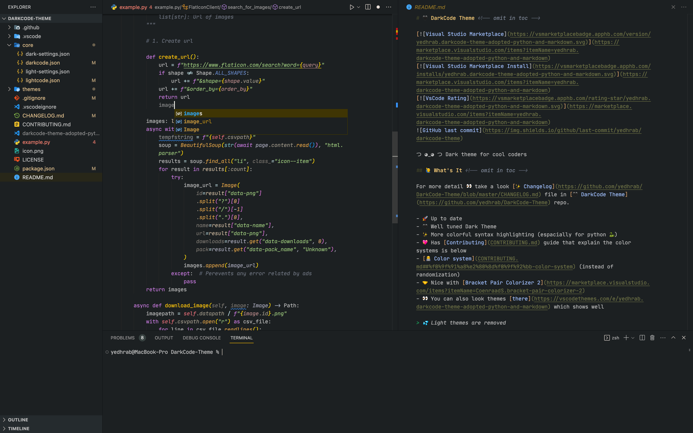
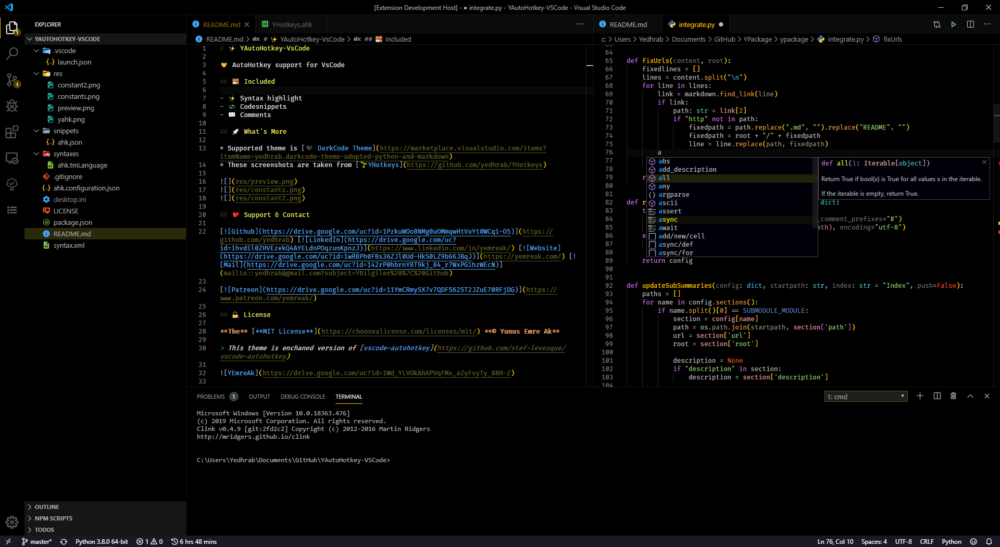
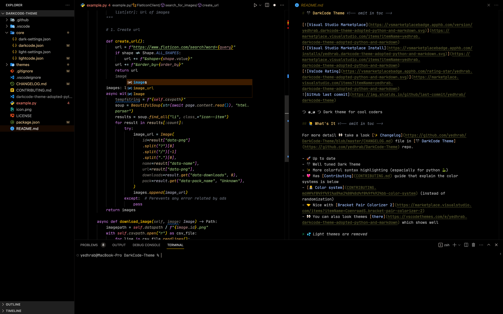
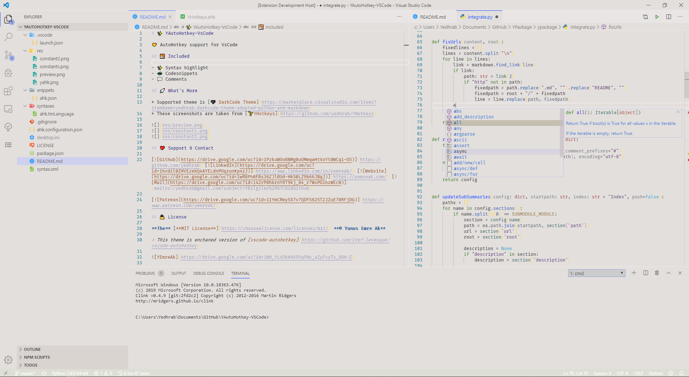
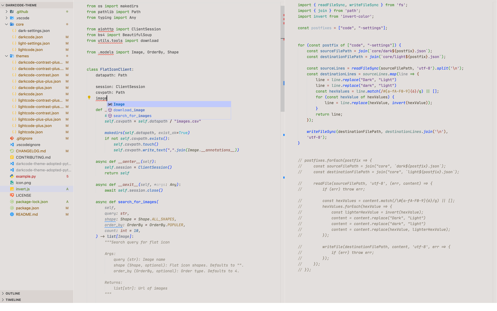
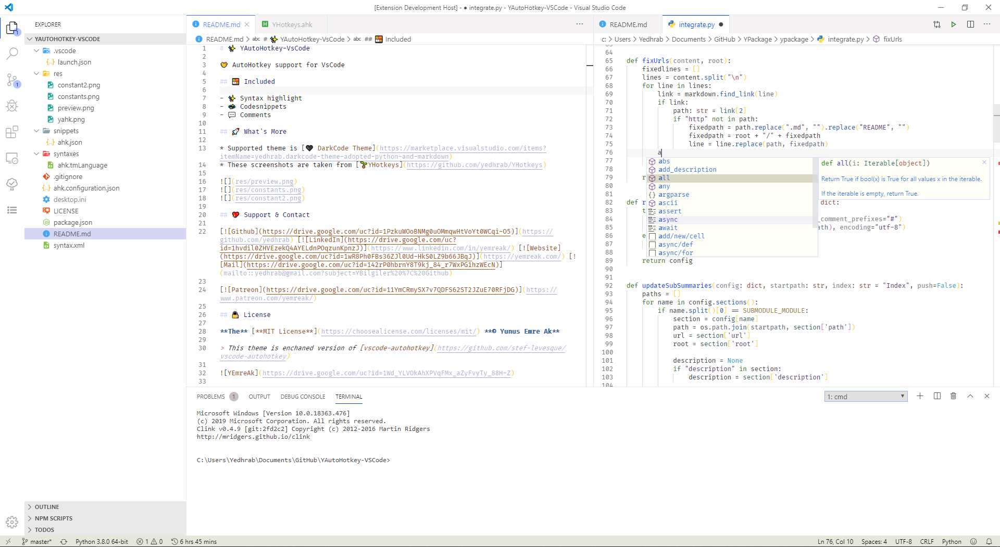
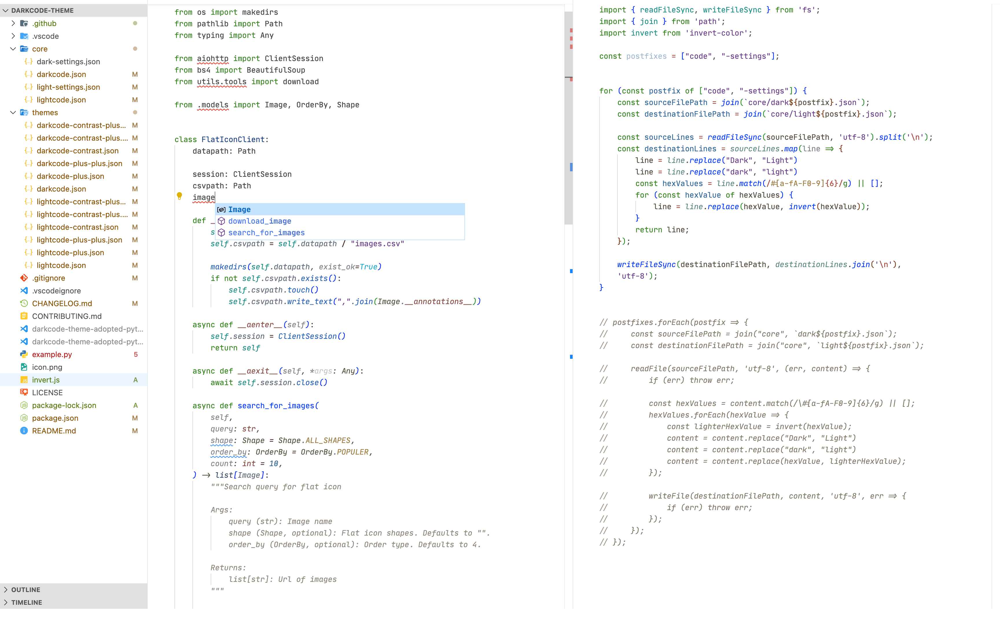
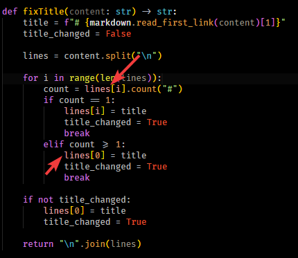

# 🖤 DarkCode Theme <!-- omit in toc -->

༼ つ ◕_◕ ༽つ Dark - Light theme for cool coders 👩‍💻👨‍💻

## 🙋‍♂️ What's It <!-- omit in toc -->

For more detail 👀 take a look [✨ Changelog](https://github.com/yedhrab/DarkCode-Theme/blob/master/CHANGELOG.md) file in [🖤 DarkCode Theme](https://github.com/yedhrab/DarkCode-Theme) repo.

- 🚀 Up to date
- 🖤 Well tuned Dark Theme
- 🤍 Fresh Light Theme
- ✨ More colorful syntax highlighting
- 💖 Has [Contributing](CONTRIBUTING.md) guide that explain the color systems is below
- [👨‍💻 Color system](CONTRIBUTING.md##%f0%9f%91%a8%e2%80%8d%f0%9f%92%bb-color-system) (instead of randomization)
- 🤝 Nice with [Bracket Pair Colorizer 2](https://marketplace.visualstudio.com/items?itemName=CoenraadS.bracket-pair-colorizer-2)

> 👀 You can also look themes [there](https://vscodethemes.com/e/yedhrab.darkcode-theme-adopted-python-and-markdown)

## 🎯 Focused <!-- omit in toc -->

- 📑 Markdown
- 🐍 Python
- ☕ Java
- 👨‍💻 AutoHotkey ~ [YAutoHotkey](https://marketplace.visualstudio.com/items?itemName=yedhrab.yautohotkey)
- ⚛️ React
- so on...

## 👁‍🗨 Previews

### 🌘 DarkCode

### 🌘 DarkCode+

### 🌘 DarkCode++

### 🌑 DarkCode Contrast

### 🌚 DarkCode Contrast+

### 🌚 DarkCode Contrast++

### 🌔 LightCode

### 🌖 LightCode+

### 🌞 LightCode++

### ☀️ LightCode Contrast

### 🌞 LightCode Contrast+

### 🌞 LightCode Contrast++

## 👨‍💻 What's New in Code Languages

### 🚀 AutoHotkey Support

### 👮‍♂️ Item Access

### 🚗 Function Call Arguments

### ☕ Java and Other Languages Support

## 🐛 Knowed Issue

This issue happend caused by Python tokenizer fault, not theme error 🙂

## 💖 Support & Contact

​[​​](https://github.com/yedhrab) [​​](https://www.linkedin.com/in/yemreak/) [​​](https://yemreak.com/) [​​](mailto:yemreak.com@gmail.com?subject=DarkCode-Theme%20%7C%20GitHub)​

​[​](https://www.patreon.com/yemreak/)

## 🔏 Lisans

**The** [**Apache 2.0 License**](https://choosealicense.com/licenses/apache-2.0/) **©️ Yunus Emre Ak**

> 🎈 Inspired by [CodeSandbox](https://marketplace.visualstudio.com/items?itemName=ngryman.codesandbox-theme)

