# 🖤🤍 DarkCode Theme <!-- omit in toc -->

༼ つ ◕_◕ ༽つ Dark - Light theme for cool coders 👩‍💻👨‍💻

## 🙋‍♂️ What's It <!-- omit in toc -->

For more detail 👀 take a look [DarkCode-Theme](https://github.com/yedhrab/DarkCode-Theme) GitHub repository.

- 🚀 Up to date
- 🖤 Well tuned Dark Theme
- 🤍 Fresh Light Theme
- ✨ More colorful syntax highlighting
- 💖 Has [Contributing](CONTRIBUTING.md) guide that explain the color systems is below
- [👨‍💻 Color system](CONTRIBUTING.md##%f0%9f%91%a8%e2%80%8d%f0%9f%92%bb-color-system) (instead of randomization)
- 🤝 Nice with [Bracket Pair Colorizer 2](https://marketplace.visualstudio.com/items?itemName=CoenraadS.bracket-pair-colorizer-2)

## 🎯 Focused <!-- omit in toc -->

- 📑 Markdown
- 🐍 Python
- ☕ Java
- 👨‍💻 AutoHotkey ~ [YAutoHotkey](https://marketplace.visualstudio.com/items?itemName=yedhrab.yautohotkey)

## 📋 Contents <!-- omit in toc -->

- [👁‍🗨 Previews](#%f0%9f%91%81%e2%80%8d%f0%9f%97%a8-previews)
  - [🌘 DarkCode](#%f0%9f%8c%98-darkcode)
  - [🌘 DarkCode+](#%f0%9f%8c%98-darkcode)
  - [🌘 DarkCode++](#%f0%9f%8c%98-darkcode)
  - [🌑 DarkCode Contrast](#%f0%9f%8c%91-darkcode-contrast)
  - [🌚 DarkCode Contrast+](#%f0%9f%8c%9a-darkcode-contrast)
  - [🌚 DarkCode Contrast++](#%f0%9f%8c%9a-darkcode-contrast)
  - [🌔 LightCode](#%f0%9f%8c%94-lightcode)
  - [🌖 LightCode+](#%f0%9f%8c%96-lightcode)
  - [🌞 LightCode++](#%f0%9f%8c%9e-lightcode)
  - [☀️ LightCode Contrast](#%e2%98%80%ef%b8%8f-lightcode-contrast)
  - [🌞 LightCode Contrast+](#%f0%9f%8c%9e-lightcode-contrast)
  - [🌞 LightCode Contrast++](#%f0%9f%8c%9e-lightcode-contrast)
- [👨‍💻 What's New in Code Languages](#%f0%9f%91%a8%e2%80%8d%f0%9f%92%bb-whats-new-in-code-languages)
  - [🚀 AutoHotkey Support](#%f0%9f%9a%80-autohotkey-support)
  - [👮‍♂️ Item Access](#%f0%9f%91%ae%e2%80%8d%e2%99%82%ef%b8%8f-item-access)
  - [🚗 Function Call Arguments](#%f0%9f%9a%97-function-call-arguments)
  - [☕ Java and Other Languages Support](#%e2%98%95-java-and-other-languages-support)
- [🐛 Knowed Issue](#%f0%9f%90%9b-knowed-issue)
- [💖 Support & Contact](#%f0%9f%92%96-support--contact)
- [🔏 License](#%f0%9f%94%8f-license)

## 👁‍🗨 Previews

### 🌘 DarkCode

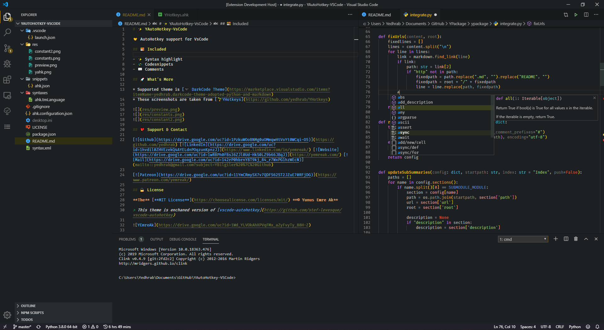

### 🌘 DarkCode+

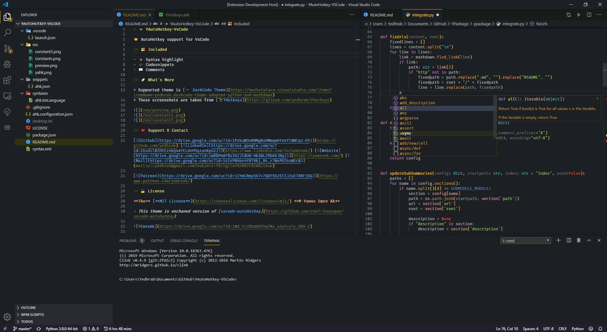

### 🌘 DarkCode++

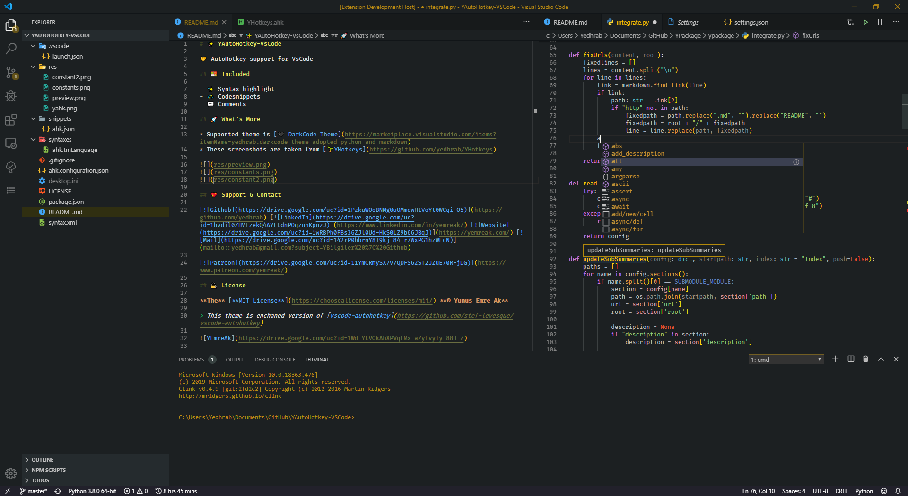

### 🌑 DarkCode Contrast

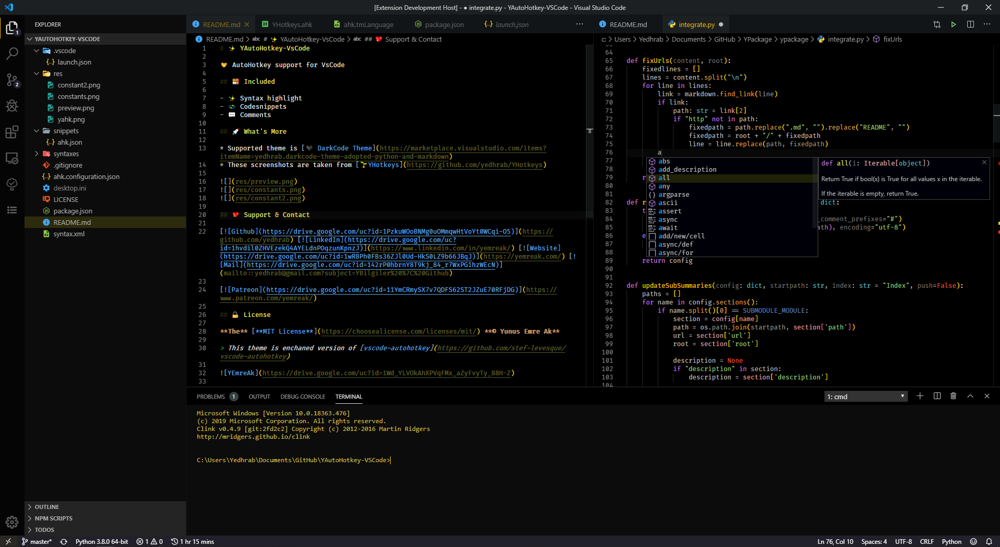

### 🌚 DarkCode Contrast+

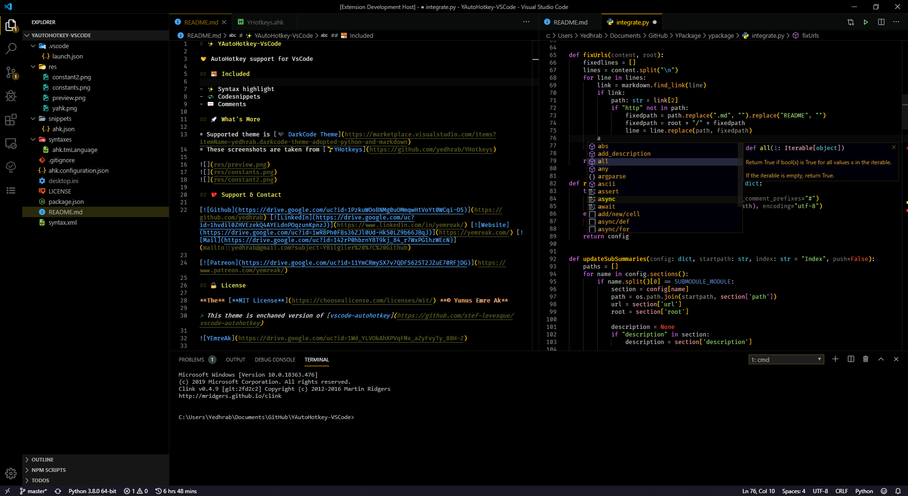

### 🌚 DarkCode Contrast++

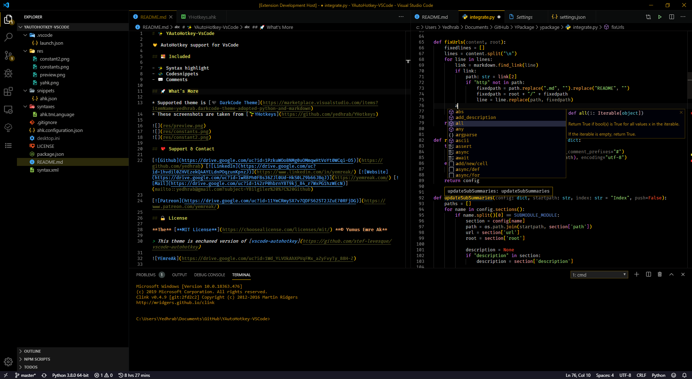

### 🌔 LightCode

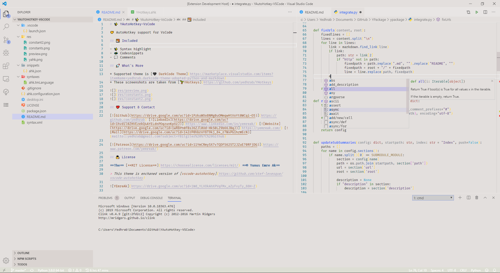

### 🌖 LightCode+

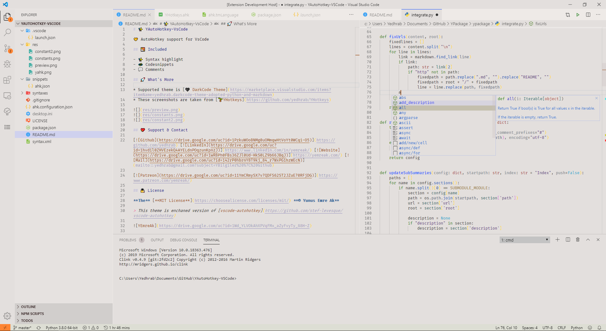

### 🌞 LightCode++

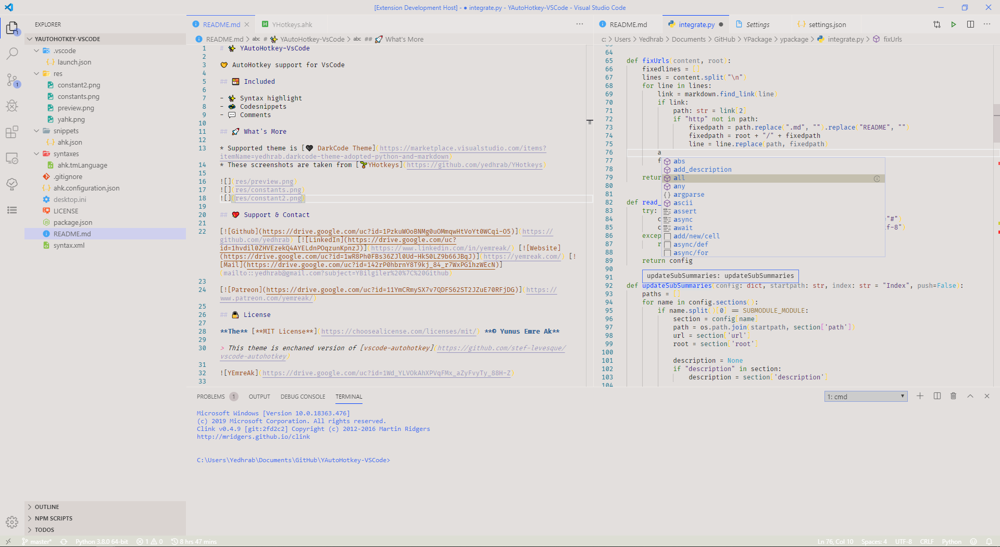

### ☀️ LightCode Contrast

### 🌞 LightCode Contrast+

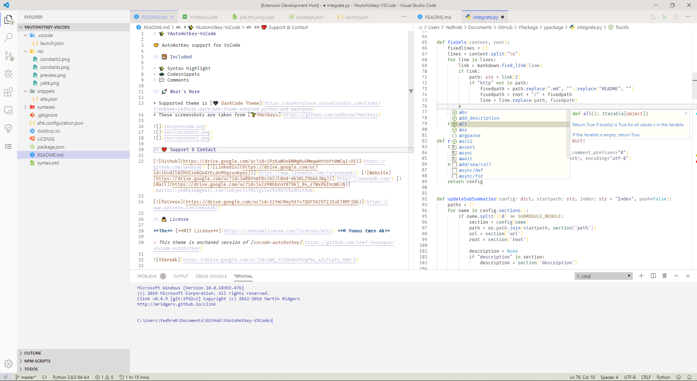

### 🌞 LightCode Contrast++

## 👨‍💻 What's New in Code Languages

### 🚀 AutoHotkey Support

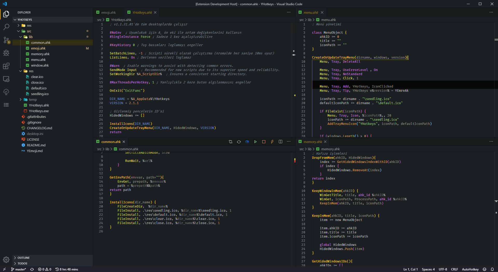

### 👮‍♂️ Item Access

### 🚗 Function Call Arguments

### ☕ Java and Other Languages Support

## 🐛 Knowed Issue

This issue happend caused by Python tokenizer fault, not theme error 🙂

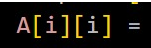

## 💖 Support & Contact

​[​​](https://github.com/yedhrab) [​​](https://www.linkedin.com/in/yemreak/) [​​](https://yemreak.com/) [​​](mailto::yedhrab@gmail.com?subject=DarkCode%20Theme%20%7C%20Github)​

​[​](https://www.patreon.com/yemreak/)

## 🔏 License

**The** [**MIT License**](https://choosealicense.com/licenses/mit/) **© Yunus Emre Ak**

> 🎈 Inspired by [CodeSandbox](https://marketplace.visualstudio.com/items?itemName=ngryman.codesandbox-theme)

